#SSO域控单点登陆方法

基本环境

```sh
Windows Server 2012域IP:192.168.7.161
WEB服务器IP:192.168.10.254
客户机IP(任意)：192.168.7.157 需用域用户加入域
```

##Setup1.配置Server 2012域控

1.安装完Server服务器，需要安装配置域服务

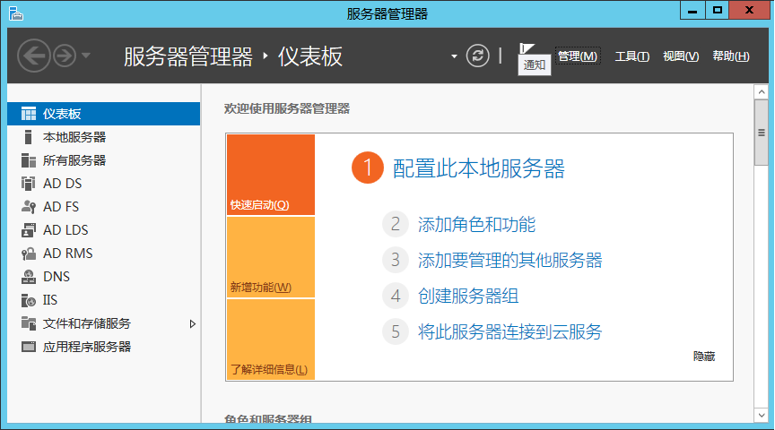

2.点击管理-添加角色和功能


3.选择基于角色或基于功能的安装
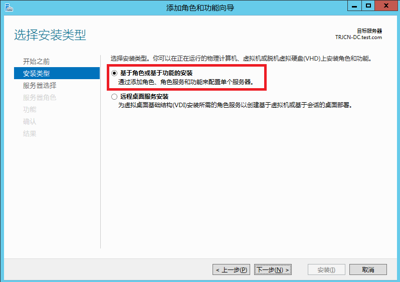

4.选择需要安装的服务器，这里是本机服务器
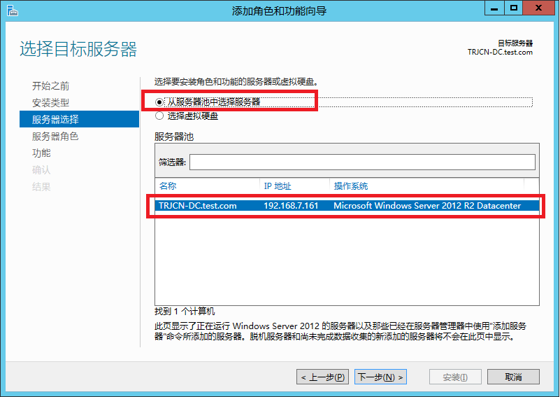

5.这里已经安装过，首次安装需要选择这些选项，这样安装完成之后ktpass导出kerberos共享密钥命令才可用。
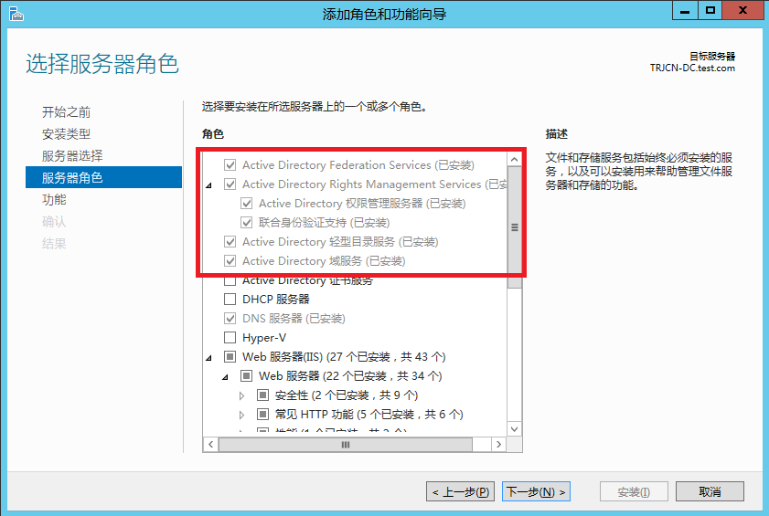

至此域服务器安装成功，接下来需要配置域用户信息
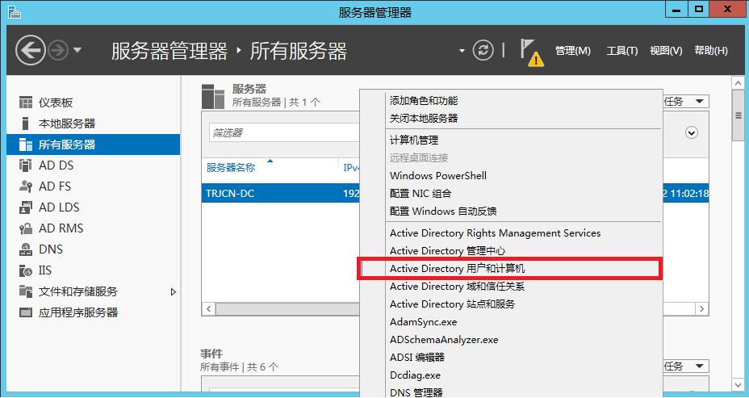

这里创建了一个组织机构IT，并添加了三个用户，需要注意的是域用户选择账户为永不过期，并配置kerberos加密支持。


打开CMD命令导出mark用户的共享密钥-**非常重要**(apache/nginx或php扩展验证均需要此证书)

```sh
ktpass -princ  HTTP/trjcn.test.com@TEST.COM -mapuser mark  -pass Trj2016 -crypto all -ptype KRB5_NT_SRV_HST  -out e:/mark.keytab
#将生成的mark.keytab复制到apache机器上的/etc/keytab/目录下；
#注意以上命令中HTTP/trjcn.test.com@TEST.COM需要和apache/nginx中的相关配置严格保持一致；
```

接下来配置一下dns服务器，添加客户机DNS解析(此选项为可选配置)

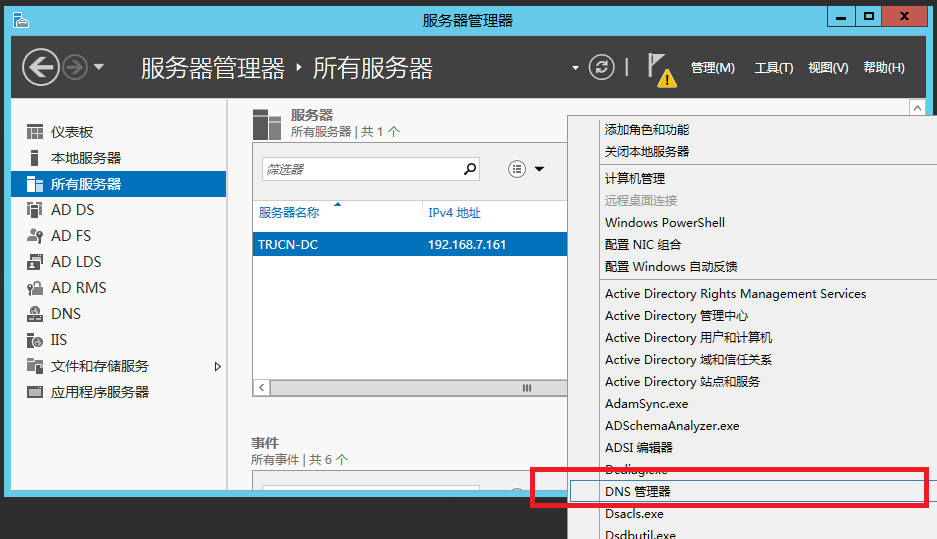
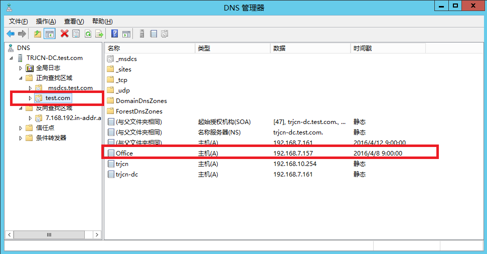

接下来的配置非常重要参[微软官方文档](https://blogs.msdn.microsoft.com/openspecification/2011/05/30/windows-configurations-for-kerberos-supported-encryption-type/)

增加域用户支持的kerberos协议

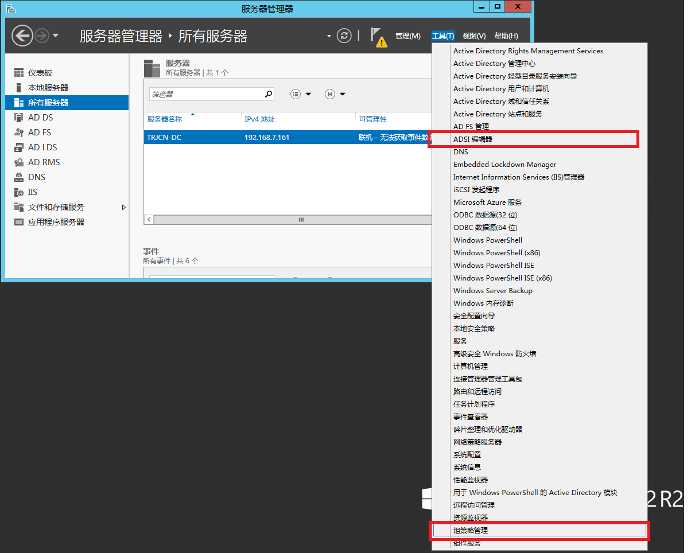
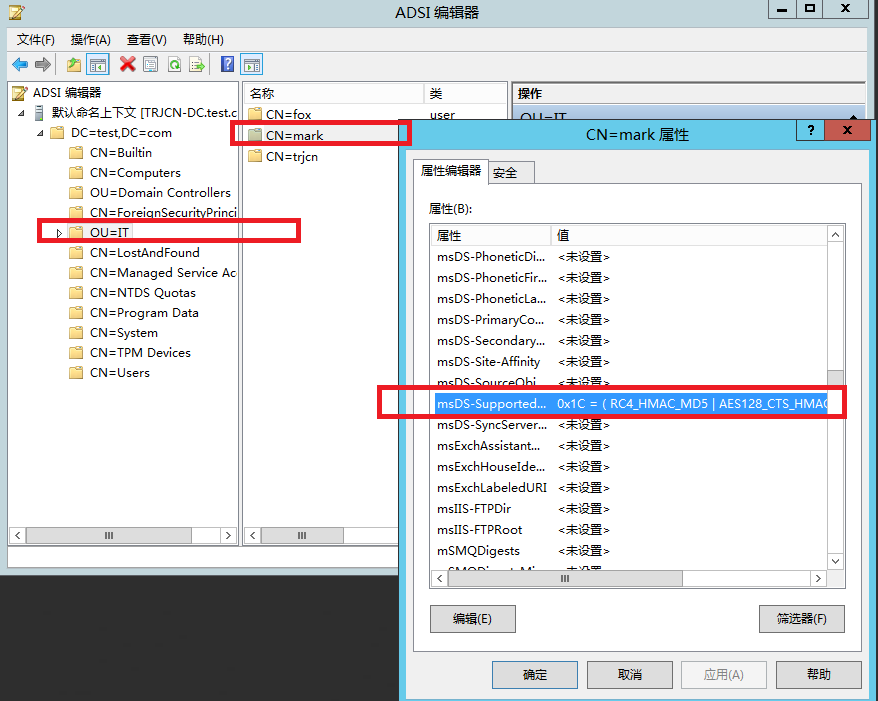

这里配置查看域策略


本地策略也非常重要，通过gpedit.msc打开本地策略编辑器

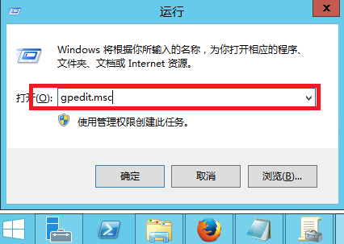

默认网络kerberos允许的加密协议是没有选中的，需要打开这些加密协议支持。
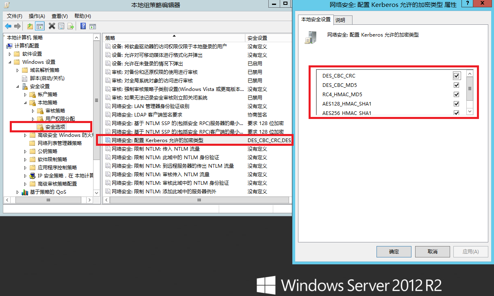

至此域服务器配置成功，每个用户都要导出自己的共享密钥才可以参与认证。

##Setup2.服务端校验

### 配置DNS服务

```sh
#更新DNS指向域控服务器IP 比如ifcfg-eth0
vi /etc/sysconfig/network-scripts/ifcfg-*
#增加DNS配置-域控服务器IP
DNS1=192.168.7.161

#增加域搜索
vi /etc/resolv.conf
search test.com
```

###配置Kerberos

```sh
[libdefaults]
default_realm = TEST.COM
ticket_lifetime = 24h
renew_lifetime = 7d
forwardable = yes
allow_weak_crypto = true

[realms]
 TEST.COM = {
  kdc = trjcn-dc.test.com
  admin_server = trjcn-dc.test.com
  default_domain = TEST.COM
 }

[domain_realm]
 .test.com = TEST.COM
 www.test.com = TEST.COM
```

###Apache校验
安装apache及kerberos扩展验证模块

```sh
yum -y install httpd mod_auth_kerb php

#配置httpd.conf-Include conf.d/*.conf
#默认已经安装并配置好mod_auth_kerb模块-auth_kerb.conf
#Include conf.d/*.conf
LoadModule auth_kerb_module modules/mod_auth_kerb.so

#更新ServerName
#ServerName www.example.com:80
ServerName localhost:80

#解决You don't have permission to access / on this server.
<Directory />
    #AllowOverride none
    #Require all denied
    #解决You don't have permission to access / on this server.
    #虚拟主机目录为非apache安装目录下的htdocs，所以违反了apache对默认对网站根访问权限
    Options Indexes FollowSymLinks
    AllowOverride None
</Directory>

#配置虚拟主机
<VirtualHost *:80>
    ServerAdmin dxwsker@qq.com
    DocumentRoot /var/www/html
    ServerName trjcn.test.com

    <Directory /var/www/html/one>
      AuthType Kerberos
      AuthName "Kerberos Login"
      KrbMethodNegotiate On
      KrbMethodK5Passwd On
      KrbAuthRealms TEST.COM
      # 域名必须和从win机器上ktpass命令导出使用的域名保持一致
      KrbServiceName HTTP/trjcn.test.com
      Krb5KeyTab /etc/keytab/mark.keytab
      require valid-user
    </Directory>

    ErrorLog logs/www.trjcn.dev-error_log
    CustomLog logs/www.trjcn.dev-access_log combined
    ServerSignature off
</VirtualHost>
#启动apache
httpd -k start
```
###Nginx校验

```sh
wget http://nginx.org/download/nginx-1.8.1.tar.gz
tar -xf nginx-1.8.1.tar.gz
cd nginx-1.8.1
#下载NGINX认证扩展
git clone https://github.com/stnoonan/spnego-http-auth-nginx-module.git
#增加SSO模块 并开启调试支持
#error_log /var/logs/nginx/error.log debug;
#通过上述配置可以查看nginx详细的请求处理情况
./configure --prefix=/usr/local/nginx --add-module=spnego-http-auth-nginx-module --with-debug
make
make install

#配置nginx.conf
vi /usr/local/nginx/conf/nginx.conf
#在HTTP配置段增加
include /usr/local/nginx/conf/vhosts/*.conf;
#创建配置server目录
mkdir /usr/local/nginx/conf/vhosts
vi /usr/local/nginx/conf/vhosts/test.conf
server {
    listen 80;
    server_name trjcn.test.com;
    root /var/www/html;
    index index.php;

    error_log logs/test.com-error.log debug;

    #if (!-f $request_filename){
    #    rewrite (.*) /index.php last;
    #}

    location ~ ^/.+\.php(/|$) {
        include fastcgi_params;
        fastcgi_pass 127.0.0.1:9000;
        fastcgi_param SCRIPT_FILENAME $document_root$fastcgi_script_name;
        fastcgi_param APPLICATION_NAME trjcn_application;

#        auth_gss on;
#        auth_gss_realm TEST.COM;
#        auth_gss_keytab /etc/keytab/mark.keytab;
#        auth_gss_service_name HTTP/trjcn.test.com;

#        auth_gss_authorized_principal mark@TEST.COM;
#        auth_gss_authorized_principal fox@TEST.COM;

    }

    location /var/www/html/one {
       auth_gss on;
       auth_gss_realm TEST.COM;
       auth_gss_keytab /etc/keytab/mark.keytab;
       auth_gss_service_name HTTP/trjcn.test.com;

    }
}

#添加用户主体，如果是多个用户需添加多个验证配置段
#auth_gss_authorized_principal mark@TEST.COM;
```

###PHP代码校验

```sh
#下载编译安装PHP
wget http://ar2.php.net/distributions/php-5.6.20.tar.gz
tar -xf php-5.6.20.tar.gz
#编译PHP
cd php-5.6.20
./buildconf --force
./configure --with-libedit --with-readline --prefix=/usr/local/php --enable-soap --enable-fpm --enable-phpdbg --with-config-file-path=/usr/local/php/etc --disable-rpath --with-curl --enable-fileinfo --enable-ftp --enable-zip --with-zlib --with-bz2 --enable-opcache --enable-calendar --with-mhash --enable-mbstring --enable-bcmath --enable-mbregex --enable-exif --with-mysqli --with-pdo-mysql --enable-gd-native-ttf --enable-shmop --enable-pcntl --enable-sockets --enable-exif --with-pcre-dir --with-xsl --with-gd --with-openssl --with-freetype-dir --with-jpeg-dir --with-png-dir --without-pear --without-iconv --with-tsrm-pthreads --enable-zend-signals --enable-maintainer-zts 
make
make install
#安装kerb5扩展支持
#https://pecl.php.net/package/krb5 
wget https://pecl.php.net/get/krb5-1.0.0.tgz
tar -xf krb5-1.0.0.tgz
cd krb5-1.0.0
/usr/local/php/bin/phpize 
./configure --prefix=/usr/local/php/lib/php/extensions/no-debug-zts-20131226 --with-php-config=/usr/local/php/bin/php-config
make
make install
#启用此扩展
vi /usr/local/php/etc/php.ini
;加载kerberos扩展
extension=krb5.so
#终止默认PHP\APACHE进程
killall -9 php-fpm
httpd -k stop
#启动NGINX
/usr/local/php/sbin/php-fpm
/usr/local/nginx/sbin/nginx
```

###测试代码

/var/www/html/info.php

```
<?php
phpinfo();
```

/var/www/html/one/index.php测试代码
```php
<?php
echo "You have log in as ".$_SERVER['REMOTE_USER']; 
```
/var/www/html/one/info.php

```php
<?php
foreach ($_SERVER as $key_name => $key_value) {
	print $key_name . " = " . $key_value . "<br/>";
}
```

###PHP测试代码

/var/www/html/test.php

```php
<?php
if(!extension_loaded('krb5')) {
	die('KRB5 Extension not installed');
}

$auth = new KRB5NegotiateAuth('/etc/keytab/mark.keytab');


if($auth->doAuthentication()) {
	echo 'Success - authenticated as ' . $auth->getAuthenticatedUser();
	
	try {
		$cc = new KRB5CCache();
		$auth->getDelegatedCredentials($cc);
	} catch (Exception $error) {
		echo 'No delegated credentials available';
	}
} else {
	if(!empty($_SERVER['PHP_AUTH_USER'])) {
		header('HTTP/1.1 401 Unauthorized');
		header('WWW-Authenticate: Basic', false);
	} else {
		// verify basic authentication data
		echo 'authenticated using BASIC method<br />';
	}
}
```

##Setup3.客户端配置

将Windows客户机加入域服务器，并更新hosts配置文件，指向web服务器IP

```sh
#需要管理员权限赋予CMD命令提示符
notepad c:/windows/system32/drivers/etc/hosts
#增加IP到域名的映射
192.168.10.254 trjcn.test.com

#打开浏览器测试
#查看服务器环境信息-查看相关扩展是否已经安装
http://trjcn.test.com/info.php
#查看apache/nginx集成认证
http://trjcn.test.com/one/
#查看PHP代码认证
http://trjcn.test.com/test.php
```

##试验结果

Apache域验证扩展：http://modauthkerb.sourceforge.net/install.html

基于Apache2.4.18编译kerberos扩展失败，Apache从2.4.9开始才支持PHP处理器指令SetHandler,通过此指令集成PHP-FPM非常方便，只要简单按下面的方法配置即可。

```sh
<FilesMatch \.php$>
     SetHandler "proxy:fcgi://127.0.0.1:9000"
</FilesMatch>
```

因为PHP-FPM扩展已经被PHP官方收购，并内置于PHP代码包了，处理效率要比apache自带的PHP扩展处理PHP更加高效，内存占用更小，所以建议升级到新版的Apache2.4.9以上。通过将PHP处理分离出去，也减轻了Apache自身的压力，使其更专注于HTML静态页的处理，性能也能得以提升不少。

因为编译扩展失败，无奈只能使用YUM源安装apache/php 这样安装的版本都比较低，apache版本2.2.15/php版本5.3.3，虽然版本比较低，但是通过试验一个域用户登陆，证明是可以行的，且可以正常获取$_SERVER['REMOTE_USER']域用户信息。

编译NGINX模块验证-按配置测试没有效果，也许还有哪里配置不对，打印的调试信息也非常多，接下来有兴趣可以继续深入研究。

通过编译的PHP代码模块测试域认证:

```
Warning: KRB5NegotiateAuth::doAuthentication(): No credentials were supplied, or the credentials were unavailable or inaccessible (458752,0)
```

显示没有找到域证书，现在也不清楚为什么证书失效！

